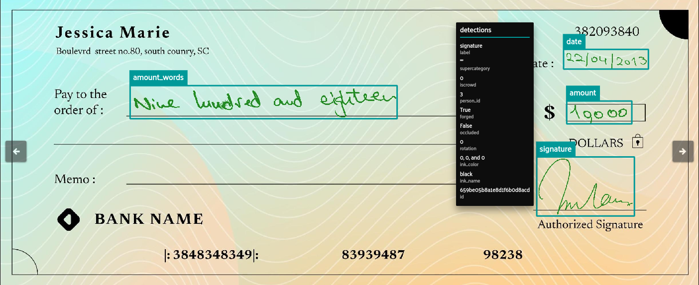
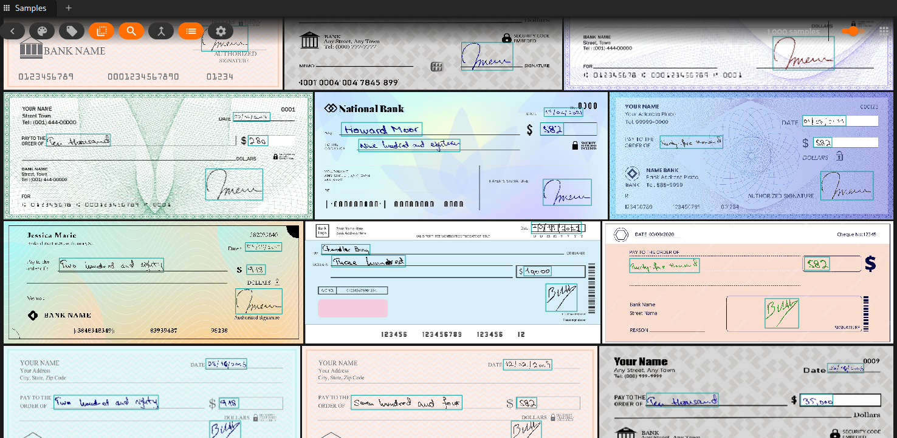

# 🏦 Enhanced Bank Check Security: Novel Dataset & Transformer-Based Signature Verification  

> 📌 *Accepted at the Document Analysis Systems (DAS) Workshop at ICDAR 2024*  
> 📄 [Read the Paper](https://link.springer.com/chapter/10.1007/978-3-031-70442-0_3)  
> ✍️ Muhammad Saif Ullah Khan*, Tahira Shehzadi*, Rabeya Noor, Didier Stricker & Muhammad Zeshan Afzal  
> *(* Equal contribution)  

---

## 🔍 Overview  

Automated **signature verification** on **bank checks** is crucial for fraud prevention and transaction security. However, real-world bank checks contain **complex layouts** with both textual and graphical elements, making this task particularly challenging.  

This repository provides:  
✅ **Synthetic Signature Bankcheck Images (SSBI) Dataset** – A **realistic** dataset with genuine & forged signatures on bank checks.  
✅ **Detection-Based Signature Verification Approach** – Treats genuine & forged signatures as separate object detection classes.  
✅ **DINO-Based Transformer Model with a Dilation Module** – Achieves **99.2% AP** for genuine and **99.4% AP** for forged signatures.  
✅ **Data Processing Scripts** – Easily **analyze**, **visualize**, and **expand** the dataset.  

---

## 📊 SSBI Dataset  

The **SSBI Dataset** contains **4,360** annotated check images with **genuine and forged signatures** from **19 different signers**. Each check also includes bounding boxes for:  
✅ **Signatures** (both genuine & forged)  
✅ **Date field**  
✅ **Amount fields** (legal & courtesy)  
✅ **Payee field**  

📥 **Download Dataset:** [SSBI v1.0.0](https://github.com/saifkhichi96/ssbi-dataset/releases/tag/v1.0.0)  
📌 **Extract to:** `data/ssbi`  

### 🗂 Dataset Statistics  

#### **Table 1: Data Split for Genuine & Forged Signatures**  

| Signature Type | Train | Validation | Total |
|---------------|-------|------------|-------|
| ✅ **Genuine** | 2,352 | 1,008 | 3,360 |
| ❌ **Forged**  | 700   | 300  | 1,000 |
| **Total**      | 3,052 | 1,308 | 4,360 |

#### **Table 2: Object Size Distribution**  

| Category          | Train (Small/Medium/Large) | Val (Small/Medium/Large) |
|-------------------|----------------------------|--------------------------|
| 💰 **Amount (Legal)**    | 440 / 1,881 / 731  | 169 / 813 / 326  |
| 💵 **Amount (Courtesy)** | 0 / 1,142 / 1,910  | 0 / 481 / 827  |
| 📅 **Date**              | 163 / 1,837 / 754  | 57 / 777 / 334  |
| 🏦 **Payee**             | 0 / 994 / 717  | 0 / 387 / 300  |
| ✍️ **Signature (Forged)** | 2 / 304 / 394  | 0 / 122 / 178  |
| ✍️ **Signature (Genuine)** | 4 / 915 / 1,433  | 1 / 358 / 649  |

🖼 **Example Check Images**:  

  
  

---

## 📌 How to Use  

### 1️⃣ **Installation**  

Clone the repository and install dependencies:  

```bash
git clone https://github.com/saifkhichi96/ssbi-dataset.git
cd ssbi-dataset
python3 -m venv venv
source venv/bin/activate
pip install -U pip wheel
pip install -r requirements.txt
```

### 2️⃣ Dataset Statistics

To analyze the dataset statistics, run:
```bash
python print_statistics.py
```

### 3️⃣ Dataset Structure

```bash
data/
│── ssbi/             # NOTE: Download & extract the dataset here
│   ├── annotations/  # COCO-style JSON annotations
│   ├── train/        # Training check images with both genuine & forged signatures
│   ├── val/          # Validation check images
```

### 🔄 Generating Synthetic Data

If the download link is unavailable or you wish to create more synthetic data, use:

```bash
python create_dataset.py
```

This script relies on the underlying data provided in the `data/sources` directory.

```bash
data/
|── sources/          # Underlying sources for the synthetic dataset
│   ├── checks/       # Original check images
│   ├── dummy_text/   # Dummy text for date, amount, and payee fields
│   ├── signatures/   # Original collection sheets with signature data
│   │   ├── genuine/  # Genuine signatures
│   │   ├── forged/   # Skilled forgeries
```

## 📜 Citation

If you use this dataset or method, please cite our paper:

```bibtex

@inproceedings{khan2024enhanced,
  title={Enhanced Bank Check Security: Introducing a Novel Dataset and Transformer-Based Approach for Detection and Verification},
  author={Khan, Muhammad Saif Ullah and Shehzadi, Tahira and Noor, Rabeya and Stricker, Didier and Afzal, Muhammad Zeshan},
  booktitle={International Workshop on Document Analysis Systems},
  pages={37--54},
  year={2024},
  organization={Springer}
}
```

## 📧 Contact
For questions, please reach out:
📩 Muhammad Saif Ullah Khan – [saifkhichi96](https://github.com/saifkhichi96)

## License

This code and dataset in this repsitory are licensed under the [CC BY-NC 4.0](https://creativecommons.org/licenses/by-nc/4.0/) license as described in the [LICENSE](LICENSE) file.

---

🔒 Enhancing Bank Check Security with Cutting-Edge AI! 🔍✨